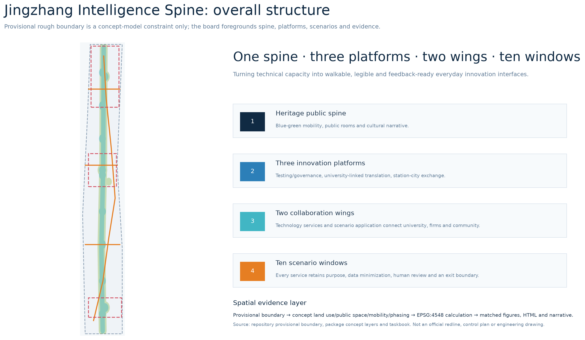
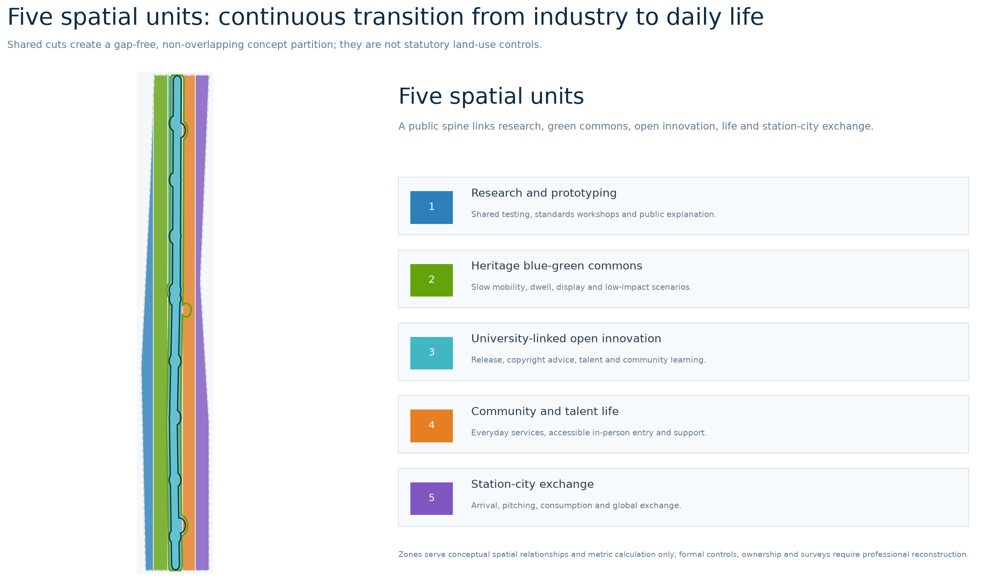
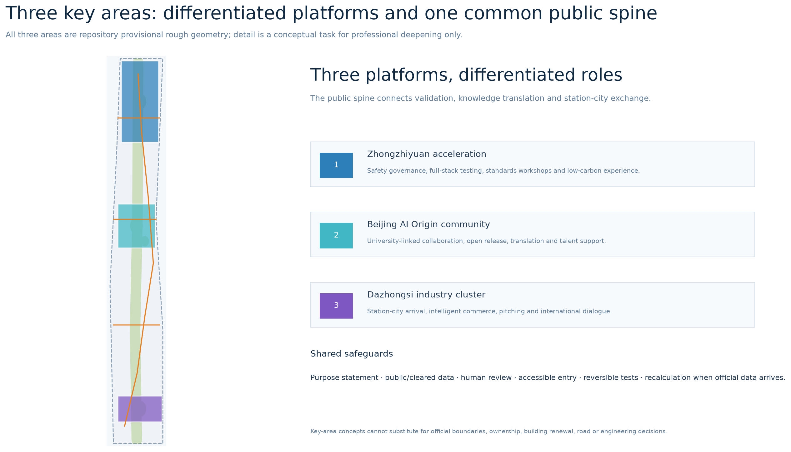
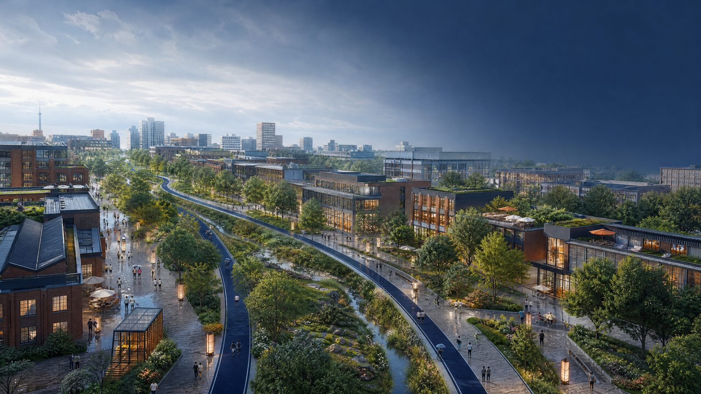
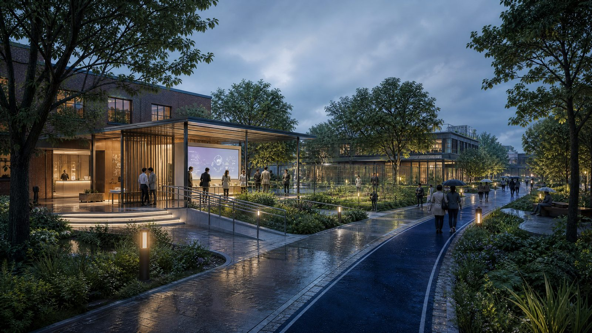
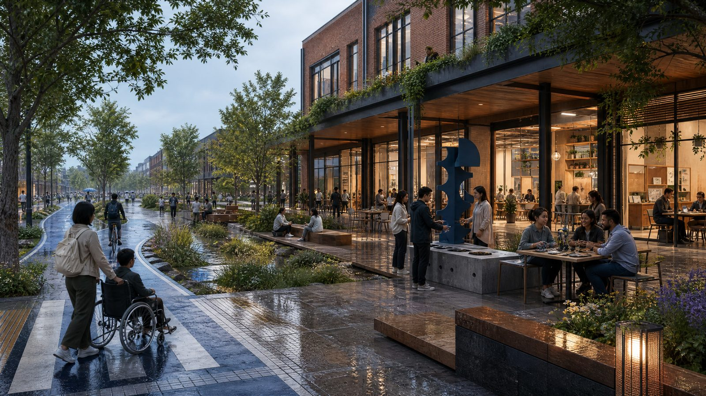
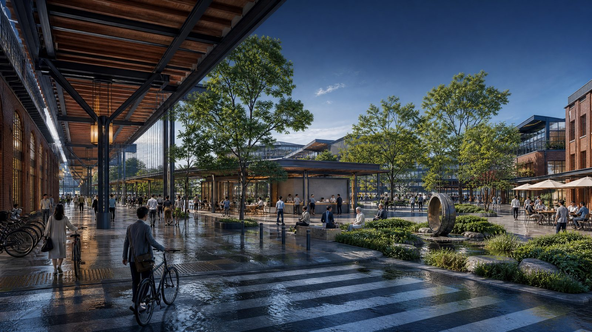
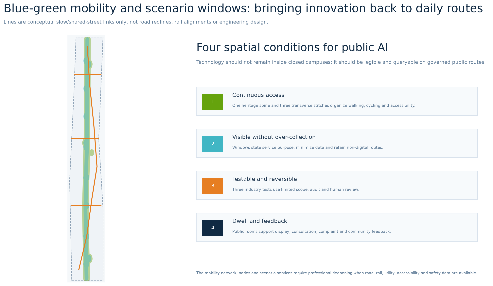
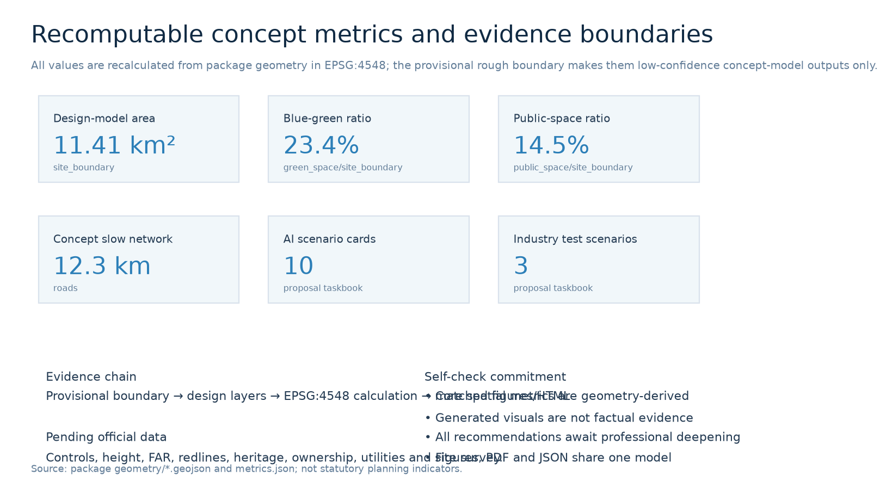

# Jingzhang Intelligence Spine: A Visible Public AI Innovation Belt

## Design Basis and Source List

This proposal treats urban design as a **conceptual space–operation interface** that can be publicly discussed, continuously checked and professionally deepened; it is not a substitute for unpublished regulatory conditions. Formal tasks, names and areas of the three scope levels follow the repository’s registered announcement and cleared taskbook. Professional expression follows the locally held snapshots on urban design, detailed-plan depth and land-use classification. [source:OFFICIAL-ANNOUNCEMENT] [source:AGENT-TASKBOOK] [standard:MOHURD-URBAN-DESIGN-MEASURES]

The public package has no verified precise redline, official key-area polygons, controls, ownership, heritage, utility or as-built survey data. To remain parseable, the package uses the repository’s provisional rough geometry as a **low-confidence concept model** only. It serves visualization, design discussion and intake self-check; official release requires whole-package replacement and recalculation. [data:geometry/site_boundary.geojson#SITE-001] [source:BOUNDARY-SOURCE] [depth:risk_missing_data]

## Three-Level Scope Framework

The coordinated research area of 43.6 km² frames the AI ecosystem and future-city relationship. The approximately 11.4 km² overall design area translates the heritage public realm, industrial renewal, talent life and slow mobility into a spatial structure. Three key areas then test full-stack innovation, university-linked translation and station-city exchange. These are not three unrelated boundaries but a strategic–structural–scenario work chain. [source:OFFICIAL-ANNOUNCEMENT] [depth:three_level_scope_framework] [metric:site_area_sqm]

Before official data is released, the package’s 11.41 km² is only a result recalculated from a provisional polygon. It neither replaces the announcement’s approximate 11.4 km² textual scope nor forms an official redline. The land-use, public-space, mobility, phasing and scenario layers make the hand-off across scopes inspectable. [data:geometry/land_use.geojson#LU-001] [data:geometry/key_areas.geojson#PROV-KEY-001] [depth:metrics_recalculation]

## Coordinated Research Area: Industry and Future City Research

The identity is **Jingzhang Intelligence Spine**. Its visual direction is a deep-blue double line with branching red nodes: the double line recalls the century-old railway and reciprocal data/knowledge flows, while nodes represent publicly visible contribution, review and service rather than corporate marks. It responds to the three stated positions of culture, urban AI life and integrated AI innovation. [standard:PROJECT-AGENT-OPEN-CALL-TASKBOOK] [depth:overall_spatial_structure]

The spatial framework is “one spine, three platforms, two wings and ten windows.” The heritage public spine is a blue-green slow-mobility commons; the three platforms address full-stack testing/governance at Zhongzhiyuan, university-linked open innovation at AI Origin, and station-city exchange at Dazhongsi. The two wings enable Zhongguancun technology services and Xiaoyuehe scenario application. Ten windows place testing, services and public feedback on walking routes. This is a reference scheme for professional deepening after boundary, heritage and transport data are confirmed. [data:geometry/public_space.geojson#PUBLIC-001] [data:geometry/roads.geojson#ROAD-001] [depth:blue_green_public_space]

| Global reference | Transferable mechanism | Conceptual translation for Jingzhang |
| --- | --- | --- |
| Helsinki AI Register | Publicly searchable AI purpose, information and feedback | Each scenario window publishes purpose, human review and feedback access |
| Singapore one-north | Proximity of research, startups, living, events and living labs | Shared testing and daily encounters across the three platforms |
| Mila Montréal | Research community, venture support and responsible-AI learning | Open collaboration, policy learning and translation at AI Origin |
| MaRS Discovery District | Urban commercialization-support hub | Pitching, enterprise service and international exchange at Dazhongsi |
| Kista Science City | Cross-sector transformative-technology ecosystem | The two wings connect universities, communities, firms and public needs |
| 22@ Barcelona | Urban transformation and innovation-district placemaking | Public spine-led renewal interfaces rather than closed campuses |
| Jing-Zhang railway culture | Historic route as legible public narrative | Walkable linkage of heritage, contribution records and future AI culture |

These references provide mechanisms only; none supports site boundaries, land use, investment, policy or engineering claims. [source:HELSINKI-AI-REGISTER] [source:JTC-ONE-NORTH] [source:MILA-ECOSYSTEM]

## Overall Design Area: Urban Renewal and Regulatory-Plan-Level Urban Design

The overall concept combines five spatial units, one public spine and three stitch lines. Research/prototyping, heritage park/blue-green commons, university-linked open innovation, community/talent life, and station-city exchange partition the same provisional boundary without gaps. The heritage spine organizes walking, cycling, encounter and scenario display. The diagram is a reviewable conceptual urban-design expression, not statutory land-use control. [data:geometry/land_use.geojson#LU-001] [depth:land_use_layout] [standard:MNR-LAND-USE-CLASSIFICATION-GUIDE]

The renewal method is “open first, validate next, deepen later.” Reversible wayfinding, public furniture, open-release events and limited scenario tests form the early stage; authorized interface renewal and service nodes are medium-term; long-term work consolidates an open ecosystem and governance capacity. Height, FAR, road redlines, demolition, energy and utilities remain pending official material. [data:geometry/phasing.geojson#PHASE-001] [depth:phasing_implementation] [metric:floor_area_ratio]

## Detailed Design of Key Areas

**Zhongzhiyuan AI Acceleration Area** is a “verifiable full-stack innovation garden.” The concept places safety evaluation, standards workshops, low-carbon computing experience and results display beside the public green spine, with purpose specification, authorization, human review and exit mechanisms for every test service. [data:geometry/key_areas.geojson#PROV-KEY-001] [standard:PROJECT-AGENT-OPEN-CALL-TASKBOOK] [depth:three_key_area_detailed_design]

**Beijing AI Origin Community** is a “university-linked open-innovation community.” It conceptually stitches university, research and daily life through an open-release hall, translation street, talent support and public learning rooms. It makes no judgment on campus boundaries, building renewal or ownership. [data:geometry/key_areas.geojson#PROV-KEY-002] [depth:retain_renovate_demolish]

**Dazhongsi AI Industry Cluster** is a “station-city living room for the intelligent economy.” Arrival, pitching, consumption, enterprise service and public dwell time are connected through walkable quadrants and explainable product display, not unbounded data extraction. [data:geometry/key_areas.geojson#PROV-KEY-003] [depth:traffic_rail_slow_parking]

## GPT Conceptual Scenario Visualizations (Non-Evidentiary)

The four images below were generated by a GPT image model from abstract space–scenario descriptions in this proposal. They help reviewers understand the experiential ambition of the public spine, trusted testing, university-linked translation and station-city exchange. They are **not** existing-condition photographs, surveys, statutory schemes, approved renderings, public opinion, or engineering evidence. No boundary, area, building height, ownership, investment, approved service or completed condition may be inferred from them. People are non-specific synthetic adults; the images contain no usable trademark, real person or legible project signage. The complete method, rights statement and limitations are recorded in `assets/media/scene-visuals-rights.md` and `report/copyright_statement.md`. [source:GPT-CONCEPT-VISUALS]

## AI Innovation Ecosystem, Personas, and AI+ Scenarios

AI scenarios are treated as governed urban-service prototypes: each must state purpose, necessary data, spatial carrier, human review, appeal/exit route and operating responsibility. The five core personas are open-source developers, startup teams, university users, nearby residents and international visitors. Their needs are collaboration, testing, learning, everyday low-threshold service and legible arrival. No persona becomes an individual trace, marketing profile or opaque automated decision. [source:AGENT-TASKBOOK] [standard:GENERATIVE-AI-INTERIM-MEASURES] [depth:municipal_new_infrastructure]

| Scenario card | Window and users | Data and human boundary |
| --- | --- | --- |
| 01 Open release hall | AI Origin; developers and students | Authorized contributions only; curator review |
| 02 Safety-governance sandbox **[test]** | Zhongzhiyuan; R&D teams and public | Isolated testing; expert approval and human review |
| 03 Edge-compute kiosk **[test]** | Public spine; startups and service staff | No sensitive personal data; appointment and audit |
| 04 AI slow-mobility guide | Heritage route; residents and visitors | Location can be switched off; non-digital signs retained |
| 05 Dazhongsi global pitch room | Station-city node; firms and visitors | Sponsor-authorized materials; no automated selection |
| 06 Qinghe low-carbon corridor **[test]** | Zhongzhiyuan green spine; R&D and public | Aggregated environmental readings only; professional review |
| 07 University-linked translation street | AI Origin; universities and startups | Human copyright and compliance consultation |
| 08 Data-governance forum | Dazhongsi; firms and public | Explains consent flow; no real transactions |
| 09 AI everyday-service street | Community edge; residents and older people | In-person option, accessibility and complaint route |
| 10 Global AI week route | Belt-wide commons; all visitors | Concept activity route subject to safety/permit review |

The ten cards map to public space, mobility and key areas. Three are explicitly limited test-validation scenarios and none claims operational approval. [data:geometry/public_space.geojson#PUBLIC-001] [metric:ai_scenario_card_count] [metric:industry_test_scenario_count]

## Land Use, Building Scale, and Retain-Renovate-Demolish Strategy

Five concept functional units cover the submitted provisional area with common partition lines. Concept building footprints only describe relations among the public spine and research/translation/exchange units. “Retain, renovate and concept-new” are options for later professional comparison, not decisions on existing buildings, ownership or demolition. [data:geometry/land_use.geojson#LU-001] [data:geometry/buildings.geojson#BLDG-001] [depth:retain_renovate_demolish]

The recalculable concept footprint is 1.0 ha. FAR, height, density, setbacks and statutory controls remain pending. Once official attachments, surveys, heritage and engineering conditions arrive, professional teams should recalculate and select renewal actions within the same evidence chain. [metric:building_footprint_area_sqm] [metric:building_height_m] [depth:development_intensity_controls]

## Transport, Rail, Municipal Infrastructure, and Public Services

One heritage slow-mobility spine and three transverse stitch lines connect scenario windows, public rooms and key areas. The concept network measures approximately 12.3 km from package line features. It does not replace existing roads, rail or redlines; crossings, parking, utilities, fire and accessibility require official base information and multi-disciplinary review. [data:geometry/roads.geojson#ROAD-001] [metric:slow_network_length_m] [depth:traffic_rail_slow_parking]

The public-service principle is “digital-first, human-reachable.” Explainable AI may assist information, booking and wayfinding, while high-impact or non-self-service situations retain in-person service, accessible communication and human referral. Edge computing, energy and data interfaces remain conceptual operational preconditions, not utility-capacity or engineering claims. [standard:BARRIER-FREE-ENVIRONMENT-LAW] [depth:municipal_new_infrastructure]

## Blue-Green Network, Public Space, and Urban Character

The heritage public spine overlays blue-green space and public rooms as an everyday innovation network. Green space supplies continuity for movement, dwell, display and low-impact testing; public rooms make technology explanation, contribution and community feedback visible. In the concept model, blue-green space is 23.4% and public space is 14.5%; both are low-confidence provisional-boundary outputs, not statutory ratios. [data:geometry/green_space.geojson#GREEN-001] [metric:green_ratio] [metric:public_space_ratio]

Three AI pilgrimage landmarks are the **Contribution Station** (authorized open-source contributions and public problems), the **Trusted Test Pavilion** (test purpose, limits and human review), and the **Century Dialogue Table** (a walkable narrative of railway heritage, Zhongguancun innovation and AI culture). They are reference public-space components without unlicensed brands, people, fonts or historical imagery, and are not construction commitments. [standard:MOHURD-URBAN-DESIGN-MEASURES] [depth:height_massing_character]

## Renewal Projects, Implementation Policy, and Phasing

| ID | Concept project | Phase | Critical dependency |
| --- | --- | --- | --- |
| JZ-01 | Heritage-route barrier stitching | Near term | Official road, rail, accessibility and safety review |
| JZ-02 | Zhongzhiyuan trusted-test garden | Near term | Service authorization, environmental and operations review |
| JZ-03 | AI Origin open-translation street | Mid term | Campus/parcel boundary, copyright and ownership coordination |
| JZ-04 | Dazhongsi station-city exchange room | Mid term | Station, intersection, utilities and fire conditions |
| JZ-05 | Public AI service and edge nodes | Mid term | Data governance, energy, network and maintenance responsibility |
| JZ-06 | Global AI week and contribution route | Long term | Public-event permit, security, copyright and co-stewardship |

Phasing follows reversible pilots, coordinated renewal and open stewardship, avoiding irreversible early commitments. Long-term operations conceptually include an annual open week, developer-contribution archive, scenario-open days and public-feedback loop: results can be shown, rules queried, harm reported and weak scenarios retired. All activity and funding mechanisms require future accountable operators and professional review. [data:geometry/phasing.geojson#PHASE-001] [depth:renewal_project_list] [depth:phasing_implementation]

## Metrics, Area Recalculation, and Compliance Matrix

Figures, HTML and PDFs use the same GeoJSON and `metrics.json`. Design-model area, blue-green and public-space ratios, slow-network length, key-area count, ten scenario cards and three test scenarios are recalculable from submitted files or task counts. FAR and height remain explicitly unknown. The three core visual metrics use identical numeric values in offline HTML. [metric:site_area_sqm] [metric:green_ratio] [metric:public_space_ratio]

`compliance_matrix.json` maps announcement sections 1.3, 1.4 and 1.5 plus agent.1–agent.6 to narrative, layers, metrics, drawings and the visual page. `standard_matrix.json` records professional-standard responses and `design_depth_matrix.json` records design depth and limitations. Together they make conceptual recommendations readable to people and traceable to structured evidence. [depth:metrics_recalculation] [standard:PROJECT-OFFICIAL-ANNOUNCEMENT]

## Risk, Copyright, and Compliance

The key risk is not insufficient futurism but misstating provisional material as confirmed fact. The narrative, GeoJSON, HTML, figures, sources and assumptions consistently disclose rough provisional boundaries, missing controls/ownership/utilities/heritage/survey data and conceptual-only spatial/operational moves. Any implementation, statutory plan, engineering, public-service launch or personal-data handling requires corresponding material, authorization and professional review. [source:SOURCE-REGISTRY] [data:geometry/constraints.geojson#CONSTRAINTS] [depth:risk_missing_data]

Later GPT scene images are listed as “AI-generated conceptual scenario visualizations” in sources and copyright statements. They are not evidence of existing conditions, survey, public opinion or engineering. They contain no real people, brands or sensitive personal data. Offline HTML loads no remote script, map, font or tracking service. Human and professional teams retain final judgment. [source:GPT-CONCEPT-VISUALS] [standard:GENERATIVE-AI-INTERIM-MEASURES]

## References

1. Haidian Branch of the Beijing Municipal Commission of Planning and Natural Resources, *Prequalification Announcement for the Centennial Jing-Zhang AI Innovation Belt Urban Design International Call*.
2. *Taskbook Extract for the Centennial Jing-Zhang AI Innovation Belt Open Call for Global Agents*.
3. Ministry of Housing and Urban-Rural Development, *Urban Design Management Measures* and *Measures for the Compilation and Examination of Regulatory Detailed Plans*.
4. Ministry of Natural Resources, *Land and Sea Use Classification Guide for Territorial Spatial Survey, Planning and Use Regulation*.
5. City of Helsinki, *AI Register*; JTC Singapore, *one-north*; Mila, *Quebec Artificial Intelligence Institute*.
6. MaRS Discovery District, *About*; Kista Science City; C40, *22@ Innovation District*.
