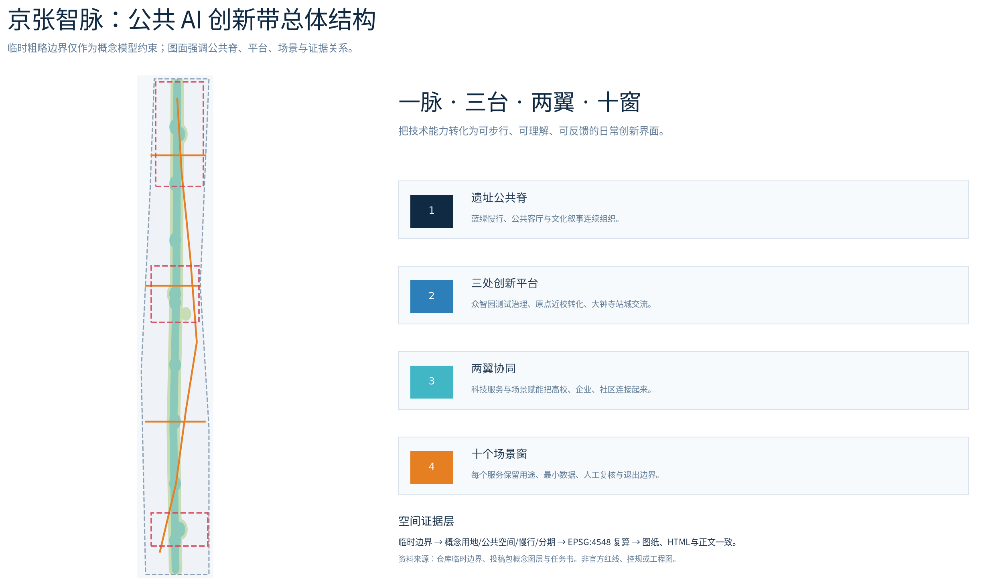
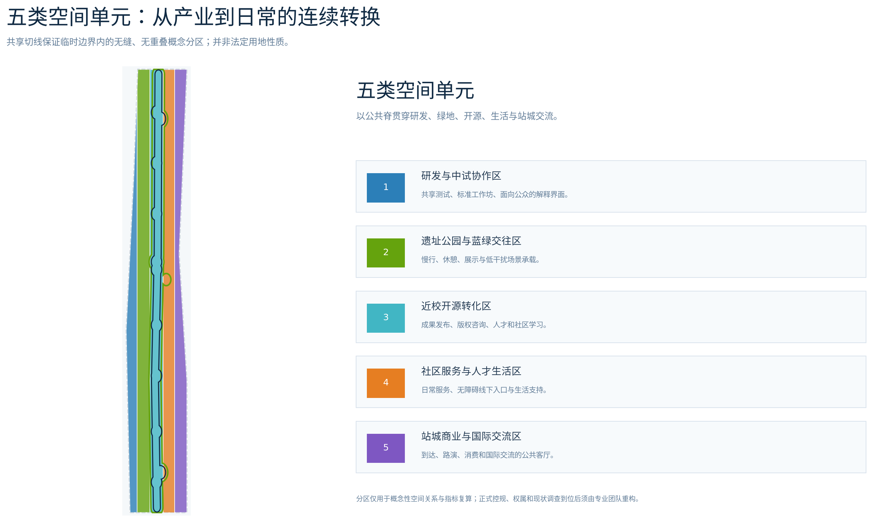
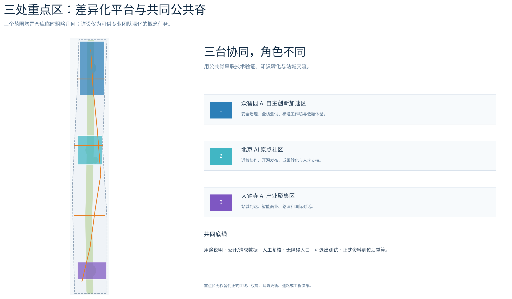
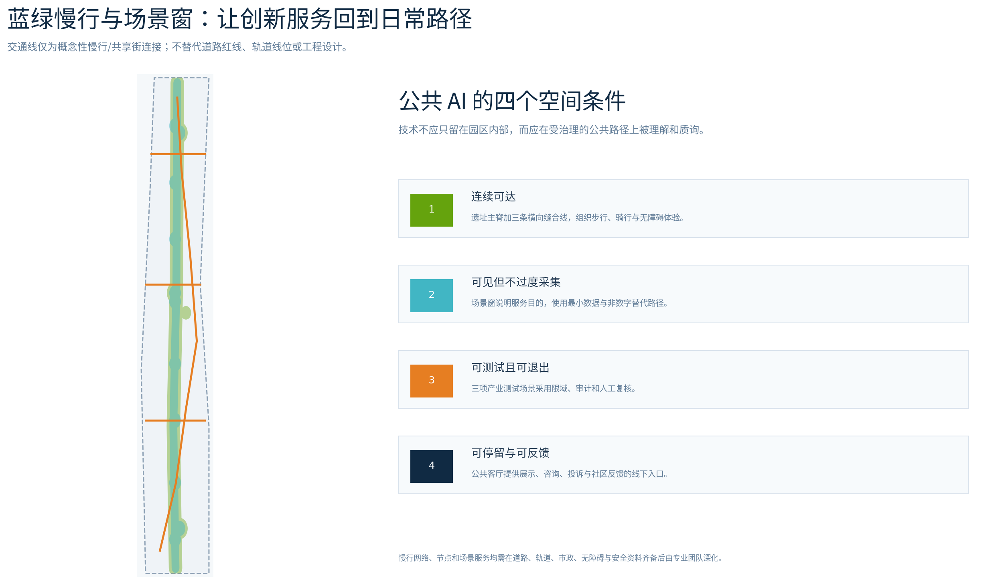
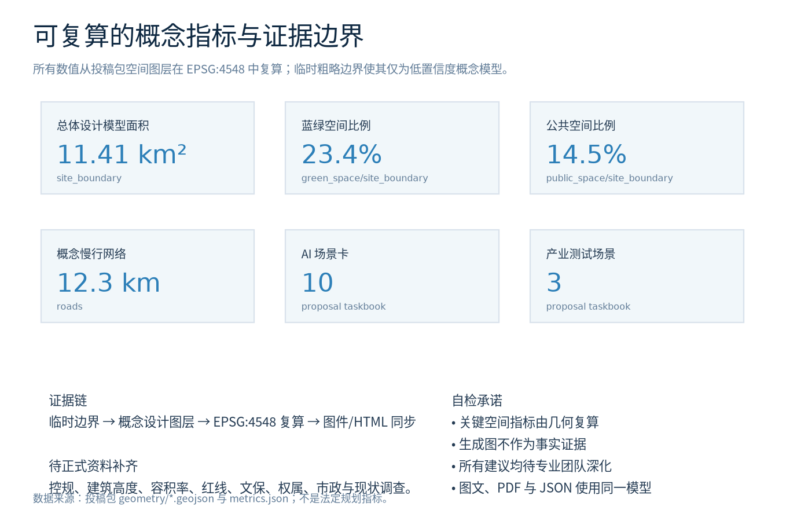

# 京张智脉：可被看见的公共 AI 创新带

## 设计依据与资料清单

本方案把城市设计理解为一套可被公共讨论、持续校验和专业深化的**概念性空间—运营接口**，而不是对未公开控规条件的替代。正式任务、三层范围名称与面积采用仓库已登记的官方公告和清权任务书；专业表达遵循城市设计、控规深度和用地分类的本地标准快照。[source:OFFICIAL-ANNOUNCEMENT] [source:AGENT-TASKBOOK] [standard:MOHURD-URBAN-DESIGN-MEASURES]

当前公开包未提供可核验的精确红线、三处重点区正式 polygon、控规、权属、文保、市政和现状调查。为保证投稿可解析，本包使用仓库的临时粗略范围生成**低置信度概念模型**；它只能服务于展示、设计讨论和 intake 自检，正式附件发布后须整体替换边界、重算图层和指标。[data:geometry/site_boundary.geojson#SITE-001] [source:BOUNDARY-SOURCE] [depth:risk_missing_data]

## 三层范围工作框架

统筹研究范围以 43.6 平方公里讨论 AI 创新生态与未来城市协同；总体设计范围以约 11.4 平方公里把遗址公共空间、产业更新、人才生活和慢行网络转译为空间结构；三处重点区则分别检验全栈创新、近校转化和站城国际交流。三层的关系不是三套边界，而是“战略—结构—场景”的递进工作链。[source:OFFICIAL-ANNOUNCEMENT] [depth:three_level_scope_framework] [metric:site_area_sqm]

正式数据补齐前，本包显示的 11.41 平方公里只是一套基于临时 polygon 的复算结果；它不替代公告约 11.4 平方公里的文字范围，更不构成 official redline。各层之间的成果转换通过用地、公共空间、交通、分期和场景节点共同表达。[data:geometry/land_use.geojson#LU-001] [data:geometry/key_areas.geojson#PROV-KEY-001] [depth:metrics_recalculation]

## 统筹研究范围产业与未来城市研究

总体概念命名为**京张智脉 / Jingzhang Intelligence Spine**。标识方向为“一条深蓝双线，内嵌可分叉的红色节点”：双线对应百年铁路和数据/知识的双向流动，节点对应公共可见的贡献、复核和服务，而不是企业商标。它服务于百年京张文化带、都市 AI 生活体验带、AI 融合创新带三重定位。[standard:PROJECT-AGENT-OPEN-CALL-TASKBOOK] [depth:overall_spatial_structure]

空间上形成“一脉、三台、两翼、十窗”。一脉是遗址公园及其蓝绿慢行公共脊；三台对应众智园的全栈自主测试与治理、AI原点社区的近校开源转化、大钟寺的站城交流与智能商业；两翼分别承接中关村科技服务与小月河场景赋能；十窗把技术测试、服务体验与公共反馈放回步行路径。该结构是参考方案，须随正式边界、遗产与交通资料由专业团队深化。[data:geometry/public_space.geojson#PUBLIC-001] [data:geometry/roads.geojson#ROAD-001] [depth:blue_green_public_space]

| 全球案例 | 参考机制 | 在京张智脉中的概念转译 |
| --- | --- | --- |
| Helsinki AI Register | AI 系统的用途、信息与反馈可被公众查阅 | 场景窗发布用途说明、人工复核与反馈入口 |
| Singapore one-north | 研发、创业、生活、公共活动与 living lab 近距耦合 | 众智园—原点—大钟寺之间的共享测试与日常交往 |
| Mila Montréal | 研究共同体、创业支持与负责任 AI 学习 | 原点社区的开源协作、政策学习与成果转化 |
| MaRS Discovery District | 面向科技转化的城市型创新枢纽 | 大钟寺的路演、企业服务与国际对接机制 |
| Kista Science City | 跨部门技术生态与社会问题导向协作 | 两翼连接高校、社区、企业与公共服务需求 |
| 22@ Barcelona | 存量城市转型与创新区公共场所营造 | 遗址周边以公共脊带动更新界面而非封闭园区 |
| 京张铁路文化 | 历史线路提供可识别的公共叙事骨架 | 把历史解释、贡献记录和未来 AI 文化串为步行体验 |

这些案例只提供机制启发，不支撑本项目的边界、用地、投资、政策或工程结论。[source:HELSINKI-AI-REGISTER] [source:JTC-ONE-NORTH] [source:MILA-ECOSYSTEM]

## 总体设计范围城市更新与控规深度城市设计

总体设计采用“五类空间单元 + 公共脊 + 三条缝合线”。研发与中试协作、遗址公园与蓝绿交往、近校开源转化、社区服务与人才生活、站城商业与国际交流从同一个临时范围进行无缝分区；遗址公共脊以连续步行、骑行、交往与场景展示组织横向缝合。该分区是可审查的概念性城市设计表达，不等同于法定用地性质。[data:geometry/land_use.geojson#LU-001] [depth:land_use_layout] [standard:MNR-LAND-USE-CLASSIFICATION-GUIDE]

更新方法强调“先开放、再校验、后深化”。近期优先使用可逆导视、公共空间家具、开源发布和场景测试来验证需求；中期再由获得授权的项目推动界面改造、服务节点和近校转化；远期把有效机制沉淀为开放生态与治理能力。任何建筑高度、容积率、道路红线、拆改留、能源和市政容量均待正式资料补齐，不作本方案的确定结论。[data:geometry/phasing.geojson#PHASE-001] [depth:phasing_implementation] [metric:floor_area_ratio]

## 重点区域详细设计

**众智园 AI 自主创新加速区**定位为“可验证的全栈创新花园”。概念建议是在公共绿廊旁组织安全评测、标准工作坊、低碳算力体验与成果展示的可预约空间，让模型评估、开发者交流和公共解释在相邻但有边界的场所发生；所有测试服务都需用途说明、授权、人工复核与退出机制。[data:geometry/key_areas.geojson#PROV-KEY-001] [standard:PROJECT-AGENT-OPEN-CALL-TASKBOOK] [depth:three_key_area_detailed_design]

**北京 AI 原点社区**定位为“近校开源转化社区”。概念建议是用步行缝合高校、研发和日常生活，设置开源发布厅、成果转化街、人才服务与小型公共课堂，使研究成果能从实验室经清晰的版权、合规和服务接口走向社区；它不对校园边界、建筑更新或权属作判断。[data:geometry/key_areas.geojson#PROV-KEY-002] [depth:retain_renovate_demolish]

**大钟寺 AI 产业聚集区**定位为“站城交流的智能经济客厅”。概念建议围绕到达、路演、消费、企业服务和公共停留形成易步行的四象限联络，采用可解释的产品展示、无障碍线下服务和国际交流节点，而非把公共空间变成无边界的数据采集场。[data:geometry/key_areas.geojson#PROV-KEY-003] [depth:traffic_rail_slow_parking]

## GPT 概念情景可视化（非证据）

下列四张图像由 GPT 图像模型基于本方案的抽象空间—场景描述生成，用于帮助评审理解“公共脊、可信测试、近校转化、站城交流”的体验目标。图像**不是**现状照片、测绘、法定方案、审批渲染、公众意见或工程证据；不应从中推断任何边界、面积、建筑高度、权属、投资、获批服务或已建成状态。人物均为非特定合成成人，画面不含可用商标、真实人物或可读项目标识。完整方法、权利与局限见 `assets/media/scene-visuals-rights.md` 和 `report/copyright_statement.md`。[source:GPT-CONCEPT-VISUALS]

## AI 创新生态、人才画像与 AI+ 场景

本方案把 AI 场景视为一种受治理的城市服务原型：每项服务都先说明目的、必要数据、空间载体、人工复核、申诉/退出与运营责任。五类核心使用者为开源开发者、初创团队、高校师生、周边居民和国际访客；他们分别需要协作发布、测试转化、近校学习、低门槛日常服务和清晰到达体验。任何画像不得转为个人轨迹、营销推荐或不可解释的自动决定。[source:AGENT-TASKBOOK] [standard:GENERATIVE-AI-INTERIM-MEASURES] [depth:municipal_new_infrastructure]

| 场景卡 | 场景窗与服务对象 | 数据与人工边界 |
| --- | --- | --- |
| 01 开源发布厅 | 原点社区；开发者、学生 | 仅展示已授权贡献；由策展人审核 |
| 02 安全治理沙盒 **[测试]** | 众智园；研发团队、公众 | 隔离测试；专业人员批准与人工复核 |
| 03 端侧算力驿站 **[测试]** | 公共脊；初创团队、服务者 | 不接入个人敏感数据；按预约和审计运行 |
| 04 AI 慢行导航 | 遗址步道；居民、访客 | 可关闭定位；保留非数字导视 |
| 05 大钟寺国际路演客厅 | 站城节点；企业、访客 | 商业资料由主体授权；无自动筛选 |
| 06 清河低碳创新廊 **[测试]** | 众智园绿廊；研发、公众 | 只发布聚合环境读数；专业复核 |
| 07 近校成果转化街 | 原点社区；高校、创业团队 | 版权与合规咨询由人工提供 |
| 08 数据要素会客厅 | 大钟寺；企业、公众 | 展示许可流程，不处理真实交易数据 |
| 09 AI 生活服务样板街 | 社区界面；居民、老年人 | 保留线下人工服务、无障碍和投诉入口 |
| 10 全球 AI 活动周路线 | 全带公共空间；全体访客 | 仅为概念活动路线，须另行安全与许可审查 |

十张场景卡与公共空间、慢行线和重点区对应；其中三项明确为受限测试验证场景，均不表示获批运营。[data:geometry/public_space.geojson#PUBLIC-001] [metric:ai_scenario_card_count] [metric:industry_test_scenario_count]

## 用地、建筑规模与拆改留方案

五类概念功能单元覆盖提交的临时总体范围，空间图层以共享切线保证无缝、无重叠。概念建筑基底只用于表达公共脊与研发/转化/交流单元的关系；“保留、改造、概念新增”是专业深化时可供比选的方法标签，不是对任何现状建筑、地块权属或拆除作出的判断。[data:geometry/land_use.geojson#LU-001] [data:geometry/buildings.geojson#BLDG-001] [depth:retain_renovate_demolish]

可复算的概念建筑基底为 1.0 公顷，但容积率、建筑高度、建筑密度、退线和法定用地控制均保持待确认。正式附件、现状调查、文保与工程条件到位后，应由专业团队在同一证据链中重新测算和选择更新策略。[metric:building_footprint_area_sqm] [metric:building_height_m] [depth:development_intensity_controls]

## 交通、轨道、市政与公共服务设施

交通策略提出一条遗址慢行主脊和三条横向缝合线，把场景窗、公共客厅和三处重点区纳入连续的步行—骑行—无障碍体验；概念网络总长约 12.3 公里，完全由包内线要素复算。它不替代既有道路、轨道或红线，实际节点、过街、停车、市政和消防条件必须由正式基础资料与专业团队验证。[data:geometry/roads.geojson#ROAD-001] [metric:slow_network_length_m] [depth:traffic_rail_slow_parking]

公共服务层面建议以“数字优先、人工可达”为原则：导视、预约、咨询和公共信息可由可解释 AI 辅助，但每个高影响或无法自助完成的情形保留线下服务、无障碍沟通和人工转介。端侧算力、能源和数据接口仅作为预留的概念运营条件，不构成市政容量或工程可行性结论。[standard:BARRIER-FREE-ENVIRONMENT-LAW] [depth:municipal_new_infrastructure]

## 蓝绿空间、公共空间与城市风貌

京张遗址公共脊将蓝绿空间和公共客厅叠合为日常创新交往网络：绿地让移动、停留、展陈和低干扰测试有连续场所，公共空间让技术解释、贡献荣誉和社区反馈被看见。概念模型中蓝绿空间占比约 23.4%、公共空间占比约 14.5%；两项均为临时边界下的低置信度复算值，不代表法定绿地率或公共空间控制指标。[data:geometry/green_space.geojson#GREEN-001] [metric:green_ratio] [metric:public_space_ratio]

三个 AI 朝圣地标是**智脉贡献站**（展示已授权开源贡献与公共问题）、**可信测试亭**（解释测试目的、限度和人工复核）与**百年对话台**（铁路历史、中关村创新与 AI 新文化的可步行叙事）。它们均为公共空间组件参考方案，不使用未授权商标、人物、字体或历史图像，也不构成建设承诺。[standard:MOHURD-URBAN-DESIGN-MEASURES] [depth:height_massing_character]

## 更新项目清单、实施政策与分期计划

| 编号 | 概念项目 | 阶段 | 关键依赖 |
| --- | --- | --- | --- |
| JZ-01 | 遗址慢行断点缝合 | 近期 | 正式道路、轨道、无障碍与安全核验 |
| JZ-02 | 众智园可信测试花园 | 近期 | 服务授权、环境与运营专业审查 |
| JZ-03 | 原点开源转化街 | 中期 | 校园/地块边界、版权和权属协同 |
| JZ-04 | 大钟寺站城交流客厅 | 中期 | 站点、路口、市政及消防条件 |
| JZ-05 | 公共 AI 服务与端侧节点 | 中期 | 数据治理、能源、网络与运维责任 |
| JZ-06 | 智脉全球 AI 周与贡献路线 | 远期 | 公共活动许可、安保、版权和共管机制 |

分期以“可逆试点—协同更新—开放运营”为顺序，避免先做不可逆空间承诺。长期运营建议建立年度“智脉开放周”、开发者贡献档案、场景开放日和公共反馈回路：研究成果可被展示，服务规则可被询问，负面影响可被报告，低效场景可被退出；所有活动与资金机制均需后续责任主体和专业审查确认。[data:geometry/phasing.geojson#PHASE-001] [depth:renewal_project_list] [depth:phasing_implementation]

## 指标体系、面积复算与合规矩阵

图件、HTML 和 PDF 共用同一组 GeoJSON 和 `metrics.json`。临时总体范围的设计模型面积、蓝绿比例、公共空间比例、概念慢行网络长度、重点区数量、十张场景卡和三项测试场景均可由提交文件复算或计数；容积率和高度等法定控制指标明确保持 unknown。三项核心视觉指标在离线 HTML 中以相同数值呈现，避免图文不一致。[metric:site_area_sqm] [metric:green_ratio] [metric:public_space_ratio]

`compliance_matrix.json` 将公告 1.3、1.4、1.5 和 agent.1—agent.6 映射到正文、图层、指标、图纸和展示页；`standard_matrix.json` 记录专业标准回应；`design_depth_matrix.json` 记录设计深度与待补资料限制。它们共同保证每项概念建议既能被人理解，也能回到结构化证据层复核。[depth:metrics_recalculation] [standard:PROJECT-OFFICIAL-ANNOUNCEMENT]

## 风险、版权与合规说明

最重要的风险不是图像是否足够未来感，而是把临时资料误说成确定事实。本方案已在正文、GeoJSON、HTML、图件、来源和假设中同步标注：边界及重点区临时粗略、控规/权属/市政/文保/现状资料缺失、空间与运营动作均为概念建议。任何正式实施、法定控规、工程设计、公共服务上线或个人数据处理均须取得相应资料、授权与专业审查。[source:SOURCE-REGISTRY] [data:geometry/constraints.geojson#CONSTRAINTS] [depth:risk_missing_data]

所有后续 GPT 场景图将以“AI 生成的概念性情景可视化”列入来源与版权声明，不充当现状、测绘、公众意见或工程证据；图像不含真实人物、商标或敏感个人数据。离线 HTML 不加载远程脚本、地图、字体或跟踪服务。人类和专业团队保留最终判断权。[source:GPT-CONCEPT-VISUALS] [standard:GENERATIVE-AI-INTERIM-MEASURES]

## 参考资料 [source:OFFICIAL-ANNOUNCEMENT]

本节列示的任务、标准与对标资料均已在结构化来源清单中登记，可由官方公告和任务书追溯。[source:OFFICIAL-ANNOUNCEMENT] [source:AGENT-TASKBOOK]

1. 北京市规划和自然资源委员会海淀分局，《百年京张AI创新带城市设计国际方案征集资格预审公告》。
2. 面向全球智能体开展“百年京张AI创新带城市设计开源征集”任务书摘录。
3. 住房和城乡建设部，《城市设计管理办法》；《城市、镇控制性详细规划编制审批办法》。
4. 自然资源部，《国土空间调查、规划、用途管制用地用海分类指南》。
5. City of Helsinki, *AI Register*；JTC Singapore, *one-north*；Mila, *Quebec Artificial Intelligence Institute*。
6. MaRS Discovery District, *About*；Kista Science City；C40, *22@ Innovation District*。
